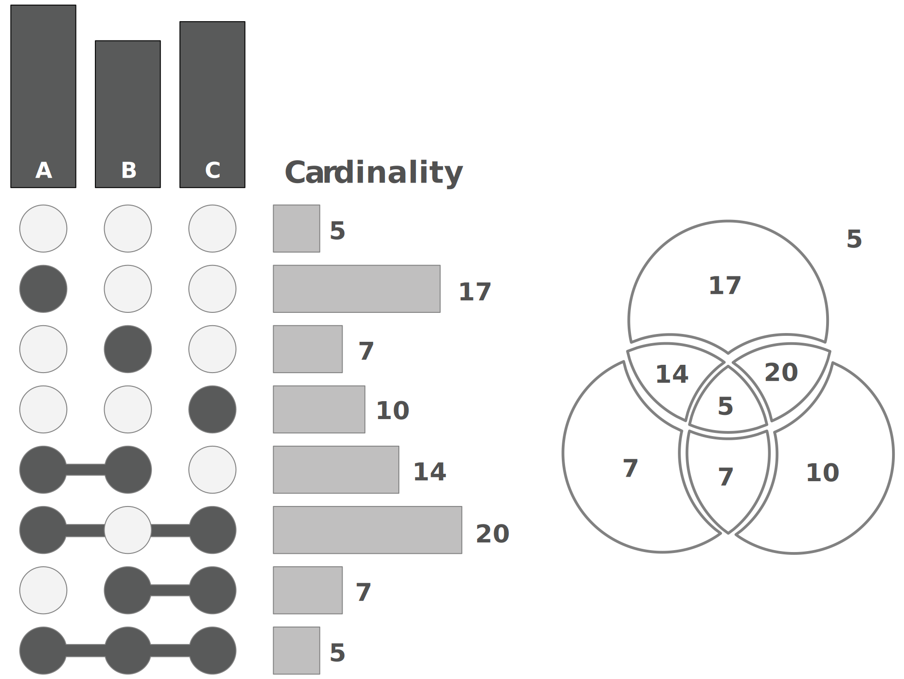
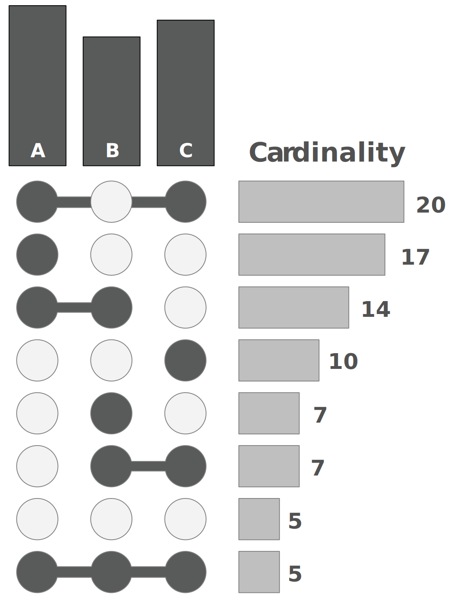
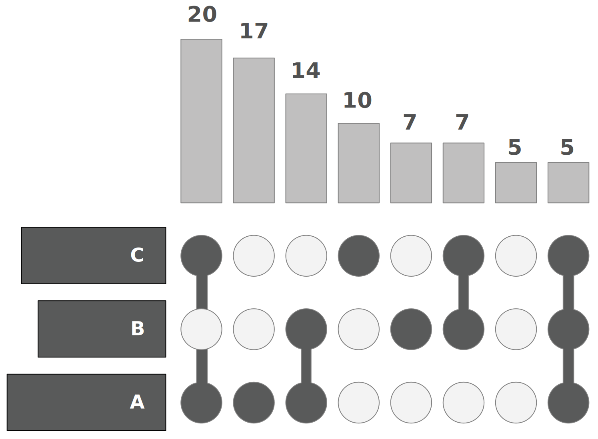
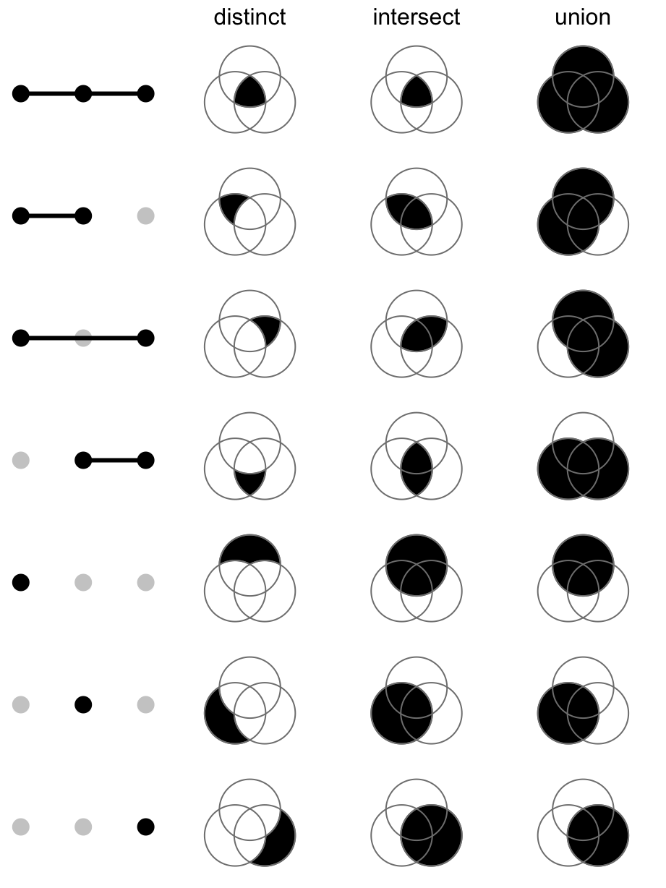
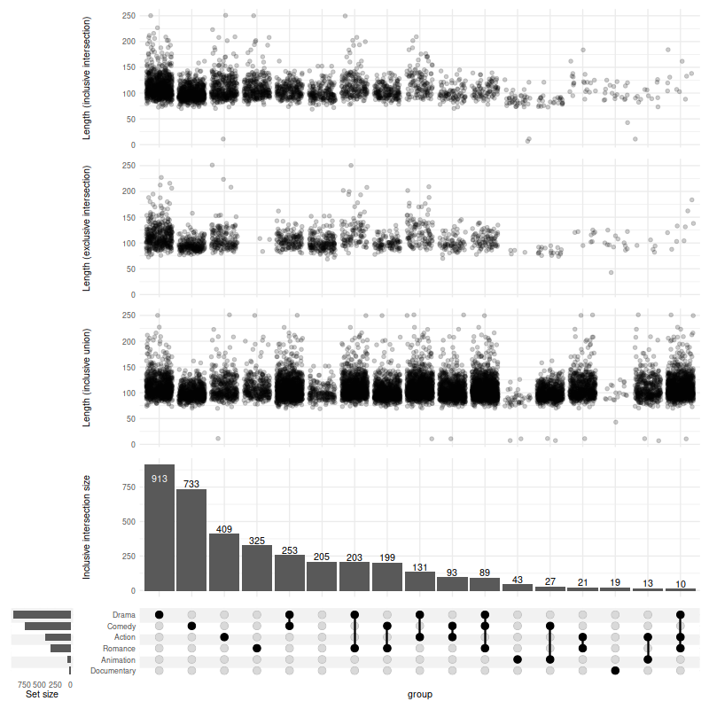

```{r include=FALSE}
library(devtools)
install_github("jokergoo/ComplexHeatmap")
library(ComplexHeatmap)
```

## Про графики UpSet

Понимание взаимосвязей между атрибутами изучаемого набора данных является важной задачей анализа. Основной проблемой в этом контексте является комбинаторный взрыв числа пересечений множеств, если количество множеств превышает тривиальный порог. Наиболее распространенный подход к визуализации наборов -- Диаграммы Венна - не масштабируется дальше трех или четырех наборов.

Графики UpSet дают возможность проводить анализ взаимосвязей гораздо большего числа атрибутов.


### Когда использовать UpSet

- UpSet лучше всего работает для наборов данных, содержащих более трех и менее 30 наборов. Для менее чем 4 наборов лучшим выбором может быть пропорциональная площади диаграмма Венна, поскольку они более привычны пользователям.
- UpSet хорошо подходит для анализа распределений и свойств многих элементов. Элементы абстрагируются как “count”, хотя атрибуты элементов могут быть визуализированы в виде интегрированных или смежных графиков.
- когда вы хотите посмотреть на все комбинации пересечений множеств. Если вы хотите посмотреть на попарные пересечения между наборами, лучшим выбором может быть какая-то матрица комбинаций.

### Описание графиков UpSet

UpSet отображает пересечения множества в виде матрицы, как показано на следующем рисунке. Каждый столбец соответствует набору, а столбчатые диаграммы сверху показывают размер набора. Каждая строка соответствует возможному пересечению: заполненные ячейки показывают, какой набор является частью пересечения. Также обратите внимание на линии, соединяющие заполненные ячейки: они показывают, в каком направлении вы должны читать график:

::: {style="display: flex; align-items: center; justify-content: center;"}
{style="margin: 0 auto;" width="341"}
:::


Рассмотрим как эти пересечения соответствуют сегментам на диаграмме Венна. 

- Первая строка на рисунке полностью пуста – соответствует всем элементам, которые не входят ни в один из наборов. 
- Зеленая (третья) строка соответствует элементам, которые находятся только в наборе B (не в A или C). 
- Оранжевая (пятая) строка представляет элементы, которые являются общими для наборов A и B, но не для C. 
- Наконец, последняя (фиолетовая) строка представляет элементы, общие для всех наборов.

::: {style="display: flex; align-items: center; justify-content: center;"}
{style="margin: 0 auto;" width="400"}
:::

Этот график хорош тем, что мы можем отобразить размер пересечений (“мощность”) в виде гистограмм прямо рядом с матрицей, как вы можете видеть в следующем примере:

::: {style="display: flex; align-items: center; justify-content: center;"}
{style="margin: 0 auto;" width="400"}
:::


Такое представление мощнойстей делает более понятным сравнение размеров пересечений.

Матрица также очень полезна, потому что ее можно сортировать различными способами. Обычным способом является сортировка по мощности (размеру), как показано на следующем рисунке, но также возможны и другие виды сортировки.

::: {style="display: flex; align-items: center; justify-content: center;"}
{style="margin: 0 auto;" width="400"}
:::

Наконец, UpSet одинаково хорошо работает как по горизонтали, так и по вертикали. Вертикальные графики лучше подходят для интерактивных графиков, которые можно прокручивать, в то время как горизонтальные графики лучше всего подходят для статичного представления.

::: {style="display: flex; align-items: center; justify-content: center;"}
{style="margin: 0 auto;" width="400"}
:::


Мы уже частично коснулись матрицы в которая содержит комбинации атрибутов, теперь рассмотрим её подробнее.


## Комбинационная матрица

График UpSet строится на комбинациях пересечений атрибутов набора данных. Атрибуты должны иметь значения (0, 1) или (TRUE, FALSE). Совокупность таких атрибутов называется комбинационной матрицей или матрицей комбинаций, рассмотрим её создание на примере пакета ComplexHeatmap.

Матрицу комбинаций можно составить из:

-   списка, содержащего несколько векторов
-   двоичной матрицы или фрейма данных, где строки являются элементами, а столбцы - наборами
-   если переменная является фреймом данных, сохраняются только двоичные столбцы (содержащие только 0 и 1) и логические столбцы.

Для простоты создадим список содержащий два вектора разных размеров и преобразуем его к матрице, чтобы посмотреть полученные комбинации

```{r}
ls <- list(set1 = c("a", "b", "c"), set2 = c("b", "c", "d", "e"))
list_to_matrix(ls)
```

В полученной матрице наборы set1 (размер вектора 3 элемента) и set2 (размер вектора 4 элемента) образуют 5 комбинаций, давайте их перечислим

-   **a** - есть только в наборе set1
-   **b** - есть в обоих наборах
-   **c** - есть в обоих наборах
-   **d** - есть только в наборе set2
-   **e** - есть только в наборе set2

Итого:

-   комбинаций, которые есть только в наборе set1 - 1 шт
-   комбинаций, которые есть в наборе set1 и set2 - 2 шт
-   комбинаций, которые есть только в наборе set2 - 2 шт

На графике это количество комбинаций или пересечений отображается как ***Intersection size***, а длины векторов или наборы в матрице как ***Set size***.

```{r echo=FALSE, fig.align='center', fig.height=3}
UpSet(make_comb_mat(ls))
```


Теперь создадим матрицу комбинаций функцией make_comb_mat.

У функции `make_comb_mat` есть три режима работы:

-   *distinct* (по умолчанию)

-   *intersect*

-   *union mode*

Как режимы влияют на пересечение наборов показано на рисунке ниже, а влияние на графиках разберем ниже.

::: {style="display: flex; align-items: center; justify-content: center;"}
[{style="margin: 0 auto;" width="341"}](https://jokergoo.github.io/ComplexHeatmap-reference/book/upset-plot.html#upset-mode)
:::

Создадим матрицу комбинаций

```{r}
# задание режимов расчета размеров набора
mx <- make_comb_mat(ls)

m2 = make_comb_mat(ls, mode = "intersect")
m3 = make_comb_mat(ls, mode = "union")

# Когда наборов слишком много, наборы могут быть предварительно отфильтрованы по заданным размерам.
# Фильтрация по размеру наборов
# min_set_size - Минимальный размер набора, который используется для генерации комбинированной матрицы
m1 = make_comb_mat(ls, min_set_size = 4)
# top_n_sets - Количество наборов с наибольшими размерами, которые используется для генерации комбинированной матрицы
m2 = make_comb_mat(ls, top_n_sets = 1) 
```

Дальше с этой матрицей будем работать черех пакет ComplexHeatmap.


## Реализация графиков UpSet

Создать графики можно на различных языках программирования, мы рассмотрим R и Python в дальнейших статьях.


Эти графики в языке R реализованы в трех пакетах:

-   UpSetR
-   ComplexHeatmap
-   ComplexUpset

Не нужно совместно инициализировать пакеты UpSetR и ComplexUpset, их методы пересекаются и привызове функции upset пакета UpSetR возникает ошибка: unused argument


А в Python в двух библиотеках:

- UpSetPlot
- pyUpSet


### Примеры графиков UpSet


::: {style="display: flex; align-items: center; justify-content: center;"}
{style="margin: 0 auto;" width="800"}
:::


::: {style="display: flex; align-items: center; justify-content: center;"}
{style="margin: 0 auto;" width="800"}
:::


::: {style="display: flex; align-items: center; justify-content: center;"}
{style="margin: 0 auto;" width="800"}
:::


## Используемые источники: 

- https://upset.app/
- https://jokergoo.github.io/ComplexHeatmap-reference/book/upset-plot.html
